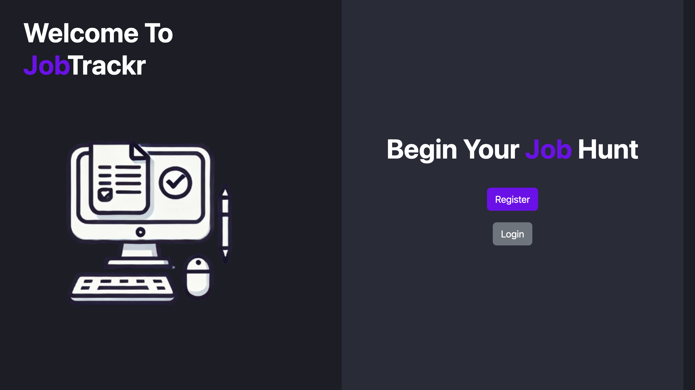
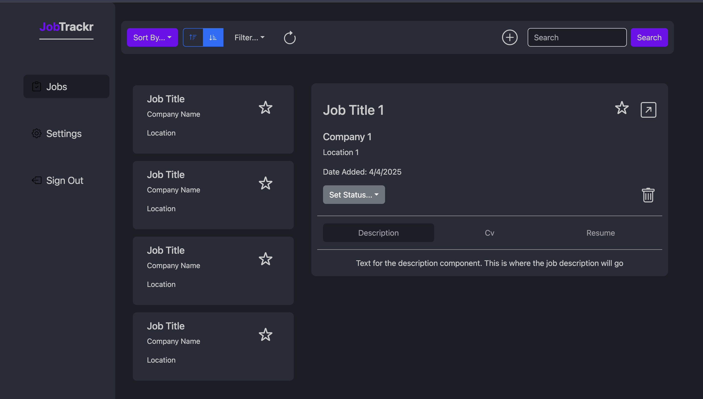
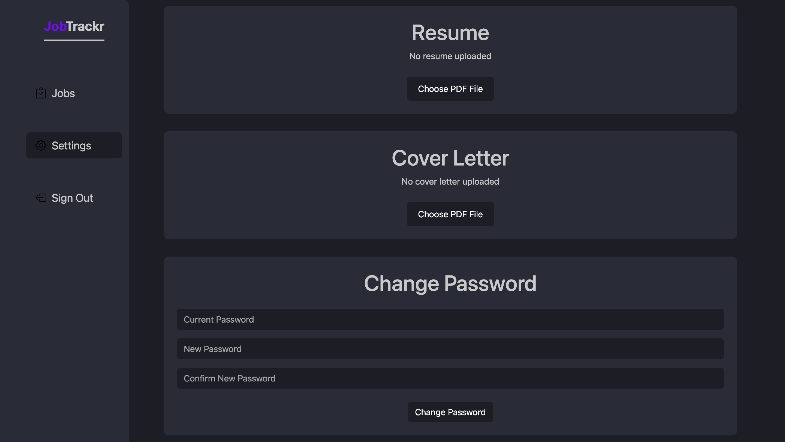

# JobTrackr

JobTrackr is a web application designed to help users track their job applications. It includes features for uploading resumes and cover letters, changing passwords, and managing job listings.

## Technologies Used

- **Backend**: Java, Spring Boot, Maven
- **Frontend**: TypeScript, JavaScript, React, npm

## Getting Started

### Prerequisites

- Java 17
- Maven
- Node.js and npm

### Backend Setup

1. Navigate to the `root` directory:
    ```sh
    cd JobApplicationManager
    ```

2. Build the project using Maven:
    ```sh
    mvn clean install
    ```

3. Run the Spring Boot application:
    ```sh
    mvn spring-boot:run
    ```

### Frontend Setup

1. Navigate to the `frontend/JobTrackrFrontend` directory:
    ```sh
    cd frontend/JobTrackrFrontend
    ```

2. Install the dependencies:
    ```sh
    npm install
    ```

3. Start the React application:
    ```sh
    npm start
    ```

## Usage

- Use postman to send api requests 

- ****!!!FRONT END WIP!!!****
- **Jobs Page**: View and manage your job applications. Receive feedback on your resume/cv
- **Settings Page**: Upload resumes and cover letters, and change your password.


## Screenshots

### 👋 Welcome Page


### 🖼 Jobs Page


### ⚙️ Settings Page



